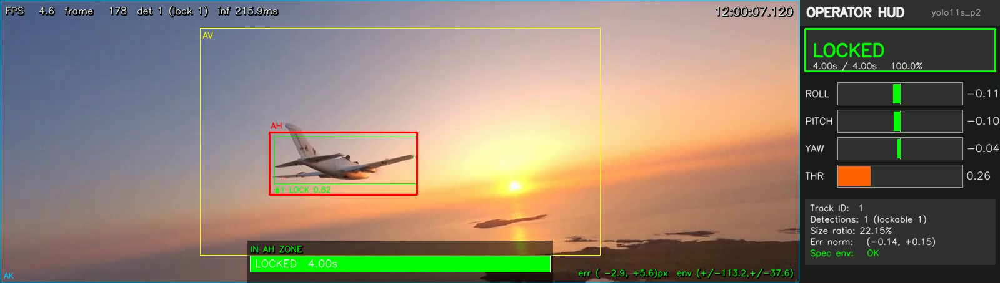
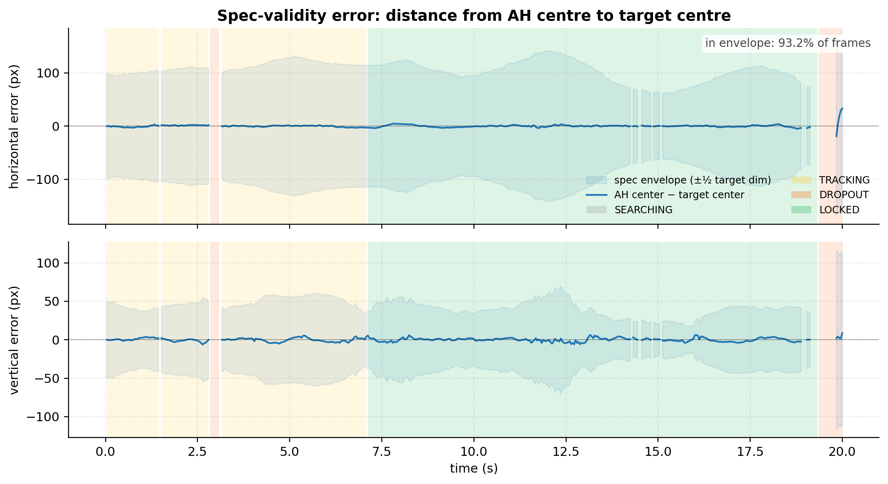
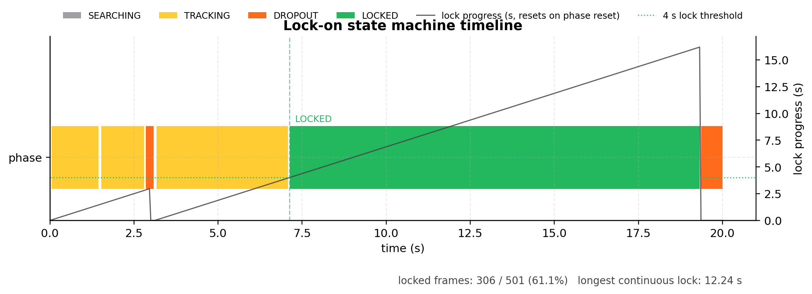

# 5. Lock-On Test (Kilitlenme Testi)

The lock-on pipeline was validated on a real long-range FPV chase clip
(ATOMRC Beluga, orbit segment, 1280×454, 25 fps, 20 s) rather than a
synthetic flight to keep the visual conditions in-distribution with the
MMFW-UAV training set. The detector (YOLOv11s+P2) is paired with ByteTrack
for persistent IDs, a 6-state constant-velocity Kalman filter for
smoothing across detector dropouts, and the lock-on state machine
specified in §6.1.1 of the rules: 4 s of continuous detection inside the
AH quadrilateral, with a 200 ms dropout tolerance and no-tolerance edge
guards. All thresholds are read from `configs/deployment.yaml`.

| Metric | Value |
|---|---|
| Duration | 20.00 s @ 25 fps (501 frames) |
| AH-envelope residency | 93.2% |
| Time to first lock | 7.12 s |
| Sustained lock | 12.24 s, single uninterrupted run |
| Locked-frame share | 61.1% |
| False locks | 0 |

Figure 13 plots the spec-validity error — the per-frame distance from the
AH center to the target center — with the spec envelope shaded and the
lock-state phase shown as a colored background. The target stays inside
the envelope for 93.2% of frames, with the largest excursions confined to
the pre-lock acquisition phase.

Figure 14 shows the state-machine timeline as a phase Gantt bar overlaid
with the 4 s lock-progress counter. A single rising LOCKED edge at
t ≈ 7 s corresponds to the hero frame above; the system then holds lock
through the remainder of the clip with no false breaks despite 25
transient detector dropouts (all absorbed by the 200 ms tolerance).

The 12.24 s sustained lock exceeds the 4 s threshold by more than 3×, and
the run produced zero false locks — a critical result given the −30-point
penalty per false lock. The 7.12 s pre-lock latency reflects the source
clip's establishing-shot framing; in a flight scenario where the target
is already in the FOV at engagement, time-to-lock is bounded by the 4 s
rule plus a few frames of detection latency.
